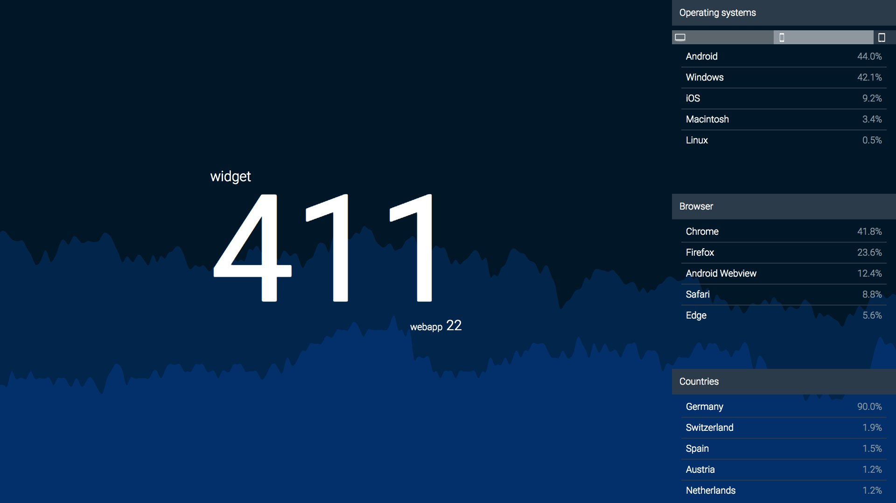

# Google Realtime Analytics Dashboard

This is a little side project which displays realtime Google Analytics Data for your projects.



## Todo / Ideas / Bugs / Stuff ...

* **Bug**  
Google OAuth doesn't work correctly. So when the `access_token` expires after 1h the app server will crash.
* **Idea**  
No Idea why I set this up with *rollup* in the first place, should propably replace it with *webpack* or go for *create-react-app*.
* **Todo**  
Maybe host this somewhere.
* **Idea**  
Add some more APIs (Facebook, Twitter, PokeAPI, whatever...).
* **Stuff**  
Currently the site is not really responsive and works best on 16:9 screens.

## Getting started

Theoretically this can be used for every property in your analytics account but it's not really setup for that. But you can still use it if you replace the project IDs and auth keys in 'config.js'.  
If you did this you can run it with the following commands:

```bash
// install dependencies
$ npm install

// start server
$ npm run server

// start rollup
$ npm run dev
```

After that you can navigate to `localhost:3000` in your browser. If everything worked and you also authenticated your Google account you should see something like in the screenshot above.

***Happy hacking!***
